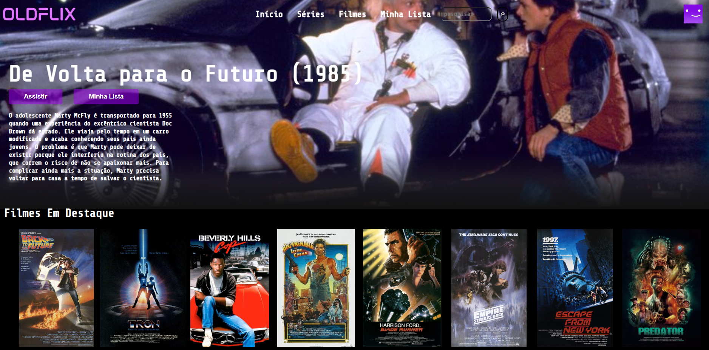

# Oldflix

## Link do projeto

<https://oldflix.netlify.app/>

Este é um projeto de um site estilo Netflix com o nome "Oldflix", só com filmes retrô dos anos 80 e 90, usando Javascript, jQuery e Slick para deixar o site mais dinâmico e interativo, semelhante aos efeitos usados na Netflix e outros serviços de streaming.

## Tabela de Conteúdos

- [Meu Processo de Desenvolvimento](#meu-processo-de-desenvolvimento)
- [Recursos Usados](#recursos-usados)
- [Autor do Projeto](#autor-do-projeto)

## Meu processo de Desenvolvimento

Pra este projeto, pensei em fazer uma interface semelhante à da Netflix, só que do meu jeito e, obviamente, com um nome diferente. Foi aí que, como sou um entusiasta de tudo relacionado a anos 80 e 90, eu pensei em fazer um streaming somente com filmes destas duas maravilhosas décadas e decidi chamar de "Oldflix". Para este projeto, além do HTML e CSS já estruturado para esta interface, usei alguns efeitos para tentar fazer o mais próximo possível da Netflix e outros serviços de streaming, como o efeito de slide ("carousel") de imagens dos filmes apenas clicando com o botão esquerdo do mouse e arrastando para o lado, assim como também o efeito de ocultar a barra de navegação superior quando a página é rolada para cima. Para o efeito de ocultar a barra de navegação, foi usado o Javascript puro. Já para o efeito de "carousel" de imagens, foi usado o Javascript em conjunto com a biblioteca jQuery e o Slick (que é o responsável pelo efeito de "carousel", ou seja, do slide de imagens). No tocante ao lado mobile responsivo, a página ainda não está 100% adaptada aos celulares, isto será consertado em breve, portanto o mais recomendado seria visitar a página da Oldflix pelo computador.

### Recursos Usados

- [Slick](http://kenwheeler.github.io/slick/) - foi usado para fazer o efeito de "carousel" nos banners dos filmes.

- [jQuery](https://jquery.com/) - biblioteca Javascript usada para o efeito de slide.

## Autor do Projeto

- GitHub - [Gabriel-L-Santos](https://github.com/Gabriel-L-Santos)
- LinkedIn - [Gabriel Leme dos Santos](https://www.linkedin.com/in/gabriel-leme-dos-santos/)
